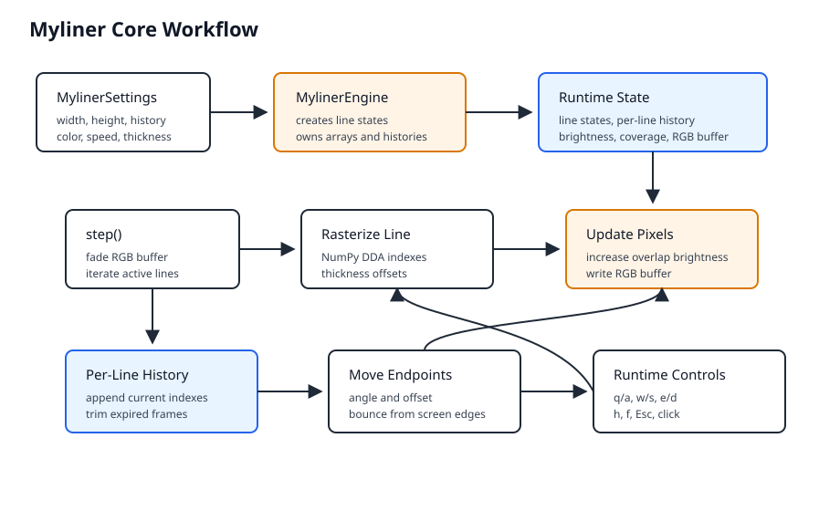

# Myliner

Myliner draws animated lines between moving points. Intersections become brighter, while older
traces fade to black. The project provides a Python engine, a Pygame application, a browser Web
Component, and a VS Code Explorer view.

## Features

- NumPy-based pixel and brightness processing.
- One to 20 independent lines with configurable history and thickness.
- Orange (`#ff6600`) as the base color.
- Windowed and fullscreen Pygame rendering.
- Reusable `<myliner-overlay>` Web Component.
- Compact VS Code Explorer integration.

## Installation

Install all dependencies in the project-local Poetry environment:

```bash
POETRY_VIRTUALENVS_IN_PROJECT=true poetry install --extras dev
```

## Desktop Application

```bash
poetry run myliner
poetry run myliner --lines 4 --history 80 --speed 10 --thickness 3
poetry run myliner --fullscreen
```

Options:

- `--lines`: initial line count from 1 to 20. Default: `1`.
- `--history`: retained frames per line. Default: `150`.
- `--max-long-side`: maximum windowed long side. Default: `800`.
- `--seed`: optional random seed.
- `--speed`: frames per second, at least 1. Default: `10`.
- `--thickness`: line thickness in pixels. Default: `3`.
- `--fullscreen`: use the native display size.

Runtime controls:

- `q/a`: add a line or remove the oldest line.
- `w/s`: select the next or previous Fibonacci speed.
- `e/d`: increase or decrease line thickness.
- `h`: toggle help.
- `f`: toggle fullscreen.
- `Esc` or mouse click: quit.

The engine can also be embedded directly:

```python
from myliner import MylinerEngine, MylinerSettings

engine = MylinerEngine(MylinerSettings(800, 450, line_count=2), seed=42)
frames = engine.step()
brightness = engine.brightness
```

## Browser Demo

Start the local server:

```bash
poetry run myliner-web --port 8000
```

Open `http://127.0.0.1:8000/demo/index.html` and stop the server with `Ctrl+C`. The React demo
starts the overlay through a link, a button, or `Ctrl+Alt+P`.

Server options:

- `--host`: server interface. Default: `127.0.0.1`.
- `--port`: server port. Default: `8000`.
- `--root`: repository root containing `demo/`.

Minimal embedding example:

```html
<script type="module" src="./myliner-web.js"></script>
<myliner-overlay
  lines="3"
  history="150"
  speed="30"
  thickness="3"
  overlay-width="50vw"
  overlay-height="50vh"
  overlay-left="50vw"
  overlay-top="50vh"
></myliner-overlay>
```

The component supports these attributes:

- `lines`, `history`, `speed`, `thickness`, and `color`: animation settings.
- `active`: start when the element connects.
- `click-to-stop`: stop after a canvas click. Default: `true`.
- `frameless`: hide the orange border.
- `transparent-background`: fade to transparency instead of black.
- `offset-min` and `offset-max`: endpoint movement range. Defaults: `5` and `20`.
- `overlay-width` and `overlay-height`: component size. Defaults: `50vw`.
- `overlay-left` and `overlay-top`: component center. Defaults: `50vw` and `50vh`.

The desktop runtime controls also work in the browser. `Ctrl+Alt+P` starts the component and `f`
switches both the browser and component fullscreen state.

## VS Code Extension

The extension in `vscode-extension/` adds a collapsible Myliner Webview to the Explorer. It does
not replace the Explorer, create an Activity Bar container, open an editor tab, or register keyboard
shortcuts. The transparent, frameless view starts with two lines, speed `10`, thickness `1`, and
endpoint offsets from `1` to `10` pixels.

Four title buttons remove or add a line and decrease or increase speed. The same actions and
`Myliner: Show Panel` are available from the Command Palette.

Install the source locally on Linux:

```bash
mkdir -p ~/.vscode/extensions/myliner-vscode
rsync -a vscode-extension/ ~/.vscode/extensions/myliner-vscode/
```

Reload VS Code, then expand Myliner in the Explorer or run `Myliner: Show Panel`.

Build and install a VSIX without global npm packages:

```bash
cd vscode-extension
npm exec --yes @vscode/vsce -- package
code --install-extension myliner-vscode-*.vsix
```

## Architecture

The core workflow is described in [docs/myliner-core.md](docs/myliner-core.md).



## Development

Run all configured checks with:

```bash
poetry run tox
```

The suite checks Poetry metadata, formatting, linting, types, tests, and at least 90% coverage.

## License

Myliner is released under the MIT License. See `LICENSE`.
