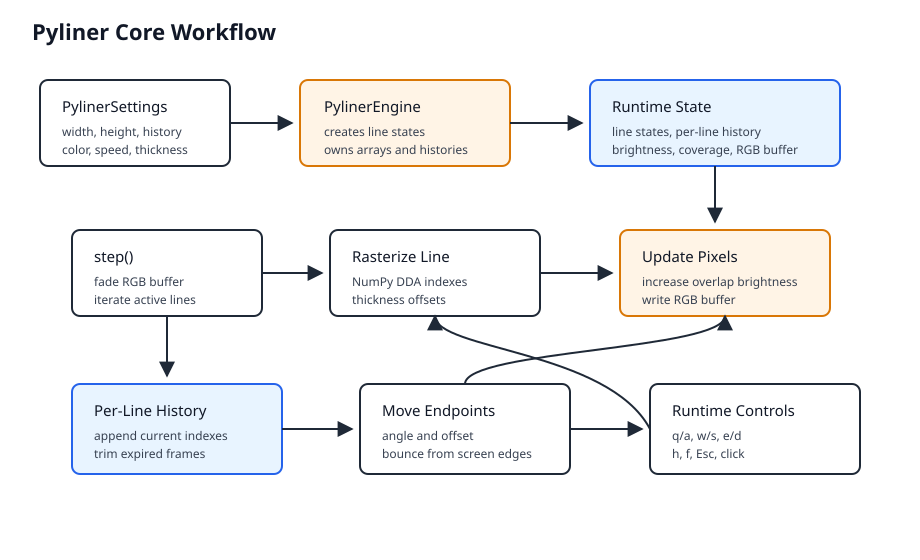

# Pyliner-Kernmodul

Der Python-Kern trennt Geometrie, Animationszustand und Darstellung. Dadurch kann der Engine ohne
Pygame importiert und getestet werden.

## Zustandsmodell

`PylinerSettings` enthält und validiert Auflösung, Linienanzahl, History, Farbe, Helligkeitsschritt,
Speed und Linienstärke.

`PylinerEngine` verwaltet drei NumPy-Arrays:

- `brightness`: zusätzlicher Helligkeitswert pro Pixel;
- `coverage`: Anzahl aktiver History-Frames pro Pixel;
- `rgb_buffer`: RGB-Daten für die direkte Darstellung.

Jede Linie besitzt eine stabile `line_id`, zwei `EdgePoint`-Objekte und eine eigene History mit
Pixelindizes. So kann der Engine die älteste Linie samt ihrer Spuren gezielt entfernen.

Ein `EdgePoint` bewegt sich von einem Rand in die Zeichenfläche. Sobald er erneut einen Rand
erreicht, erhält er eine neue Richtung und einen neuen Versatz nach innen.

## Render-Schritt

`PylinerEngine.step()` führt diese Schritte aus:

1. Bestehende RGB-Pixel werden abgedunkelt.
2. Die aktuelle Verbindung jedes Endpunktpaars wird rasterisiert.
3. Die Linienstärke wird direkt in NumPy-Pixelindizes umgesetzt.
4. Neue Pixel erhalten die Grundfarbe; Überschneidungen werden heller.
5. Die Pixelindizes werden in der History ihrer Linie gespeichert.
6. Abgelaufene Frames reduzieren Abdeckung und Helligkeit.
7. Die Endpunkte werden bewegt.

Die Pygame-Anwendung verwendet `step(return_frames=False)`. Damit aktualisiert der Engine nur den
Framebuffer und erzeugt keine zusätzlichen `LineFrame`-Objekte.

## Helligkeit und Fading

Helligkeit `0` entspricht der Grundfarbe `#FF6600`. Jede zusätzliche Überdeckung hellt das Pixel in
Richtung Weiß auf. Beim Entfernen eines Frames sinkt der Wert, jedoch nie unter `0`.

Das visuelle Fading arbeitet direkt auf dem RGB-Buffer. Dadurch dunkeln alte Spuren flüssig bis
Schwarz ab, ohne die vollständige History in jedem Render-Schritt neu aufzubauen.

## Laufzeitsteuerung

Die Pygame-Schicht verarbeitet Linienanzahl (`q/a`), Speed (`w/s`), Dicke (`e/d`), Hilfe (`h`),
Fullscreen (`f`) und Beenden (`Esc` oder Mausklick). Änderungen an Linienanzahl, Speed und Dicke
wirken ohne Neustart der laufenden Animation. Ein Fullscreen-Wechsel erzeugt Engine und Framebuffer
mit der neuen Auflösung neu.

## Web-Ausgaben

`demo/pyliner-web.js` implementiert dieselben sichtbaren Regeln mit Browser-Canvas. Die Demo zeigt
die Komponente als schwarzes Overlay; die VS-Code-Extension verwendet dieselbe Datei rahmenlos und
transparent in einer Explorer-View. Die jeweiligen Start- und Bedienmöglichkeiten sind im
`README.md` beschrieben.
